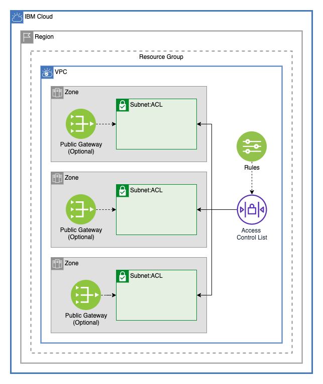
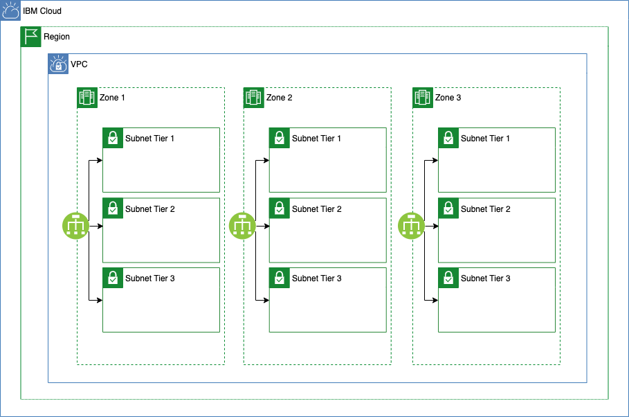
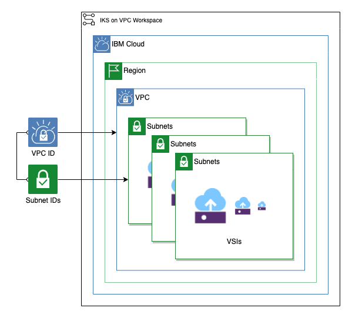
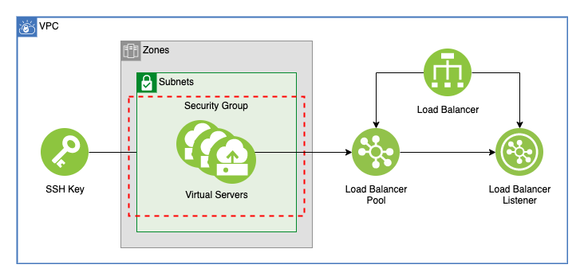
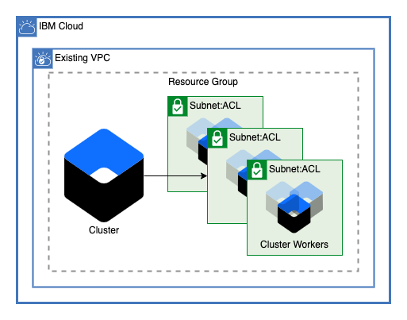

# Schematics Templates

This repo contains boilerplate Terraform repos for creating resources on IBM Cloud using IBM Schematics

## Table of Contents

1. [Multizone VPC](##Multizone-VPC)
    - Creates a VPC with one subnets in multiple zones.
2. [Multitier VPC](##Multitier-VPC)
    - Creates a VPC with three tiers across 3 availability zones.
3. [Resources](##Resources)
    - Creates commonly used cloud resources including Databases, Key Storage, Object Storage, Logging, and Monitoring
4. [VSI Workspace](##VSI-Workspace)
    - Creates virtual server instances on subnets
5. [VSI Workspace with Load Balancer](##VSI-Workspace-with-Load-Balancer)
    - Creates virtual server instances and balances traffic between them with a load balancer
6. [VPC Cluster](##vpc-cluster)
    - Creates a Kubernetes cluster on an existing VPC
7. [Object Storage on IKS](##Object-Storage-on-IKS)
    - Creates an object store and a persistant volume claim on a Kubernetes cluster.

## Multizone VPC

## Multitier VPC

## Resources

## VSI Workspace

## VSI Workspace with Load Balancer

## VPC Cluster

# Object Storage on IKS

