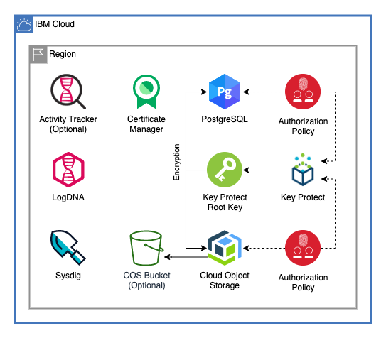

# Resources Module

This module creates commonly used cloud resources in a single resource group in a single region.

---

## Table of Contents

  1. [Endpoints](#endpoints)
  2. [Certificate Manager](#certificate-manager)
  3. [Key Protect](#key-protect)
  4. [Cloud Object Storage](#cloud-object-storage)
  5. [Databases For PostgreSQL](#databases-for-postgresql)
  6. [Activity Tracker](#activity-tracker)
  7. [LogDNA](#logdna)
  8. [Sysdig](#sysdig)
  9. [Module Variables](#module-variables)
  10. [Outputs](#outputs)

---

## Endpoints

This module creates all resources with either `public` or `private` endpoints. These endpoints are used for all resource instances

---

## Certificate Manager

Creates a certificiate manager instance with HMAC parameters. 

IBM Cloud™ Certificate Manager helps you to obtain, store and manage SSL/TLS certificates that you use for IBM Cloud deployments, or other Cloud and on-prem deployments.[1](https://cloud.ibm.com/docs/certificate-manager?topic=certificate-manager-about-certificate-manager)

You can import SSL/TLS certificates that you obtain for your apps and services, store them securely, and get a central view of the certificates that you are using. Or, you can order public certificates through Certificate Manager from supported CAs.[2](https://cloud.ibm.com/docs/certificate-manager?topic=certificate-manager-about-certificate-manager)

### More Info

For more about certificate manager read the documentation [here](https://cloud.ibm.com/docs/certificate-manager?topic=certificate-manager-about-certificate-manager)

---

## Key Protect

Creates an instance of Ket Protect and a Key Protect Root Key to encrypt the [Cloud Object Storage](##Cloud-Object-Storage) and [Databases For PostgreSQL](##Databases-For-PostgreSQL) instances.

IBM® Key Protect for IBM Cloud™ helps you provision encrypted keys for apps across IBM Cloud services. As you manage the lifecycle of your keys, you can benefit from knowing that your keys are secured by FIPS 140-2 Level 3 certified cloud-based hardware security modules (HSMs) that protect against the theft of information.[3](https://cloud.ibm.com/docs/key-protect?topic=key-protect-about)

### More Info

For more about Key Protect read the documentation [here](https://cloud.ibm.com/docs/key-protect?topic=key-protect-about)

---

## Cloud Object Storage

Creates a Cloud Object Storange instance encrypted with the [Key Protect](##Key-Protect) root key. This also creates a service-to-service authorization policy with Key Protect to allow the COS instance to read from Key Protect for encryption.

### COS Bucket

Optionally wil create a Cloud Object Storage bucket.

### More Info

Read more about Cloud Object Storage [here](https://cloud.ibm.com/docs/cloud-object-storage?topic=cloud-object-storage-getting-started).

---

## Databases For PostgreSQL

Creates an instance of Databases for PostgreSQL encrypted with the [Key Protect](##Key-Protect) root key. This also creates a service-to-service authorization policy with Key Protect to allow the Postgres instance to read from Key Protect for encryption.

#### More Info

Read more about Databases for PostgreSQL [here](https://cloud.ibm.com/docs/services/databases-for-postgresql?topic=databases-for-postgresql-getting-started).

---

## Activity Tracker

Optionally provisions an instance of Activity Tracker. There can only be one instance of Activity Tracker per account per region. 

---

## LogDNA

Provisions an instance of IBM Log Analysis with LogDNA.

Use IBM® Log Analysis with LogDNA to add log management capabilities to your IBM Cloud architecture. IBM Log Analysis with LogDNA is operated by LogDNA in partnership with IBM.[4](https://cloud.ibm.com/docs/services/Log-Analysis-with-LogDNA?topic=LogDNA-getting-started)

### More Info

Read more about IBM Log Analysis with LogDNA [here](https://cloud.ibm.com/docs/services/Log-Analysis-with-LogDNA?topic=LogDNA-getting-started).

---

## Sysdig

Provisions an instance of IBM Cloud Monitoring with Sysdig.

IBM Cloud Monitoring with Sysdig is a third-party cloud-native, and container-intelligence management system that you can include as part of your IBM Cloud architecture. Use it to gain operational visibility into the performance and health of your applications, services, and platforms. It offers administrators, DevOps teams and developers full stack telemetry with advanced features to monitor and troubleshoot, define alerts, and design custom dashboards. IBM Cloud Monitoring with Sysdig is operated by Sysdig in partnership with IBM.[5](https://cloud.ibm.com/docs/services/Monitoring-with-Sysdig?topic=Sysdig-getting-started)

### More Info
Read more about IBM Cloud Monitoring with Sysdig [here](https://cloud.ibm.com/docs/services/Monitoring-with-Sysdig?topic=Sysdig-getting-started).

---

## Module Variables

| Variable                          | Type   | Description                                                                        | Default                             |
| --------------------------------- | ------ | ---------------------------------------------------------------------------------- | ----------------------------------- |
| `ibmcloud_apikey`                 | String | The IBM Cloud platform API key needed to deploy IAM enabled resources              |
| `ibm_region`                      | String | IBM Cloud region where all resources will be deployed                              | `us-south`                          |
| `ibmcloud_vpc_generation`         | Number | The IBM Cloud platform Virtual private cloud generation you want. Typically 1 or 2 | `1`                                 |
| `resource_group`                  | String | Name of resource group to provision resources                                      | `default`                           |
| `unique_id`                       | String | Prefix for all resources created in the module. Must begin with a letter.          | `resources-module`                  |
| `tags`                            | List   | List of tags for resources                                                         | `["resources-module"]`              |
| `end_points`                      | String | Sets the endpoints for the resources provisioned. Can be `public` or `private`     | `public`                            |
| `enable_cms`                      | bool   | Creates new cms instance if true                                                   | `true`                              |
| `bring_your_own_cms`              | bool   | Bring your own cms instance. If false, one will be created                         | `false`                             |
| `cms_name`                        | string | Name of bring your own cms resource                                                | `resource-module-cms`               |
| `cms_plan`                        | String | Service plan for Certificate Manager                                               | `free`                              |
| `enable_kms`                      | bool   | Creates new key protect instance if true                                           | `true`                              |
| `bring_your_own_root_key`         | bool   | Bring your own key protect instance. If false, one will be created                 | `false`                             |
| `kms_name`                        | string | Name of bring your own kms resource                                                | `resource-module-kms`               |
| `kms_plan`                        | String | Plan to use for provisioning Key Protect                                           | `tiered-pricing`                    |
| `kms_root_key_name`               | String | Name for the root key to be created in the Key Protect instance                    | `root_key`                          |
| `enable_cos`                      | bool   | Creates new cloud object storage instance if true                                  | ` true `                            |
| `bring_your_own_cos`              | bool   | Bring your own cloud object storage instance. If false, one will be created        | `false `                            |
| `cos_name`                        | bool   | Name of bring your own cloud object storage resource                               | `resource-module-cos`               |
| `cos_plan`                        | String | Plan for Cloud Object Storage                                                      | `standard`                          |
| `create_cos_bucket`               | String | Allows for optional creation of a COS bucket. Can be true or false                 | `true`                              |
| `cos_bucket_name`                 | String | Bucket name for COS. Must be unique within account                                 | `cloud-resources-demo-bucket`       |
| `cos_bucket_storage_class`        | String | COS bucket storage class. Accepted values: `standard`, `vault`, `cold`, `flex`     | `standard`                          |
| `enable_resource`                 | bool   | Create new postgres instance if true                                               | `true`                              |
| `enable_postgres`                 | bool   | Creates new postgres instance if true                                              | `true `                             |
| `bring_your_own_postgres`         | bool   | Bring your own postgres instance. If false, one wil     l be created               | `false `                            |
| `postgres_name`                   | string | Name of bring your own postgres resource                                           | `resource-module-postgres`          |
| `postgres_plan`                   | String | Plan for PostgreSQL instance                                                       | `standard`                          |
| `enable_activity_tracker`         | bool   | Provision activity tracker, true or false                                          | `false`                             |
| `bring_your_own_activity_tracker` | bool   | Bring your own activity tracker instance. If false, one will be created            | `false`                             |
| `activity_tracker_name`           | string | Name of bring your own activity tracker name                                       | `resource-module-activity-tracker ` |
| `enable_logging`                  | bool   | Create new LogDNA instance if true                                                 | `true`                              |
| `bring_your_own_logging`          | bool   | Bring your own LogDNA instance. If false, onw will be created                      | `false`                             |
| `logging_name`                    | string | Name of bring your own logging resource                                            | `resource-module-logging`           |
| `logging_plan`                    | String | Service plan for LogDNA and Activity Tracker.                                      | `7-day`                             |
| `enable_monitoring`               | bool   | Creates new monitoring instance if true                                            | `true`                              |
| `bring_your_own_monitoring`       | bool   | Bring your own monitoring instance. If false, on will be created                   | `false`                             |
| `monitoring_name`                 | string | Name of bring your own monitoring resource                                         | `resource-module-monitoring`        |
| `monitor_plan`                    | String | Service plan for Sysdig                                                            | `graduated-tier`                    |

---

## Outputs

- `logdna_id`: ID of LogDNA Instance
- `monitoring_id` : ID of Monitoring Instance 
- `cos_id` : ID of COS Instance
- `psql_id`: ID of PSQL Instance
- `kms_id`: ID of KMS Instance
- `cms_id`: CRN of CMS instance

---