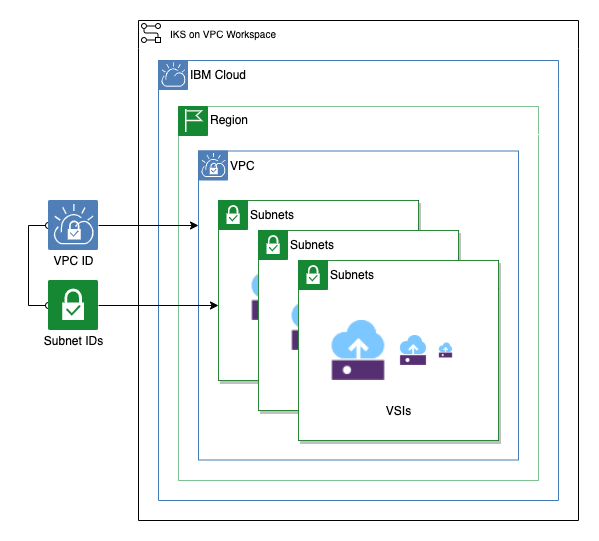

# VSI Workspace

This module creates any number of VSIs in subnets attached to a provided VPC.

### Table of Contents

- [VSI Workspace](#vsi-workspace)
  - [Table of Contents](#table-of-contents)
  - [Module Variables](#module-variables)
  - [Outputs](#outputs)

---

## Module Variables

| Variable           | Type   | Description                                                           | Default            |
| ------------------ | ------ | --------------------------------------------------------------------- | ------------------ |
| `ibmcloud_api_key` | sting  | The IBM Cloud platform API key needed to deploy IAM enabled resources |
| `ibm_region`       | string | IBM Cloud region where all resources will be deployed                 |
| `unique_id`        | string | A unique prefix for the apps. Must begin with a letter.               | `asset-module-vsi` |
| `resource_group`   | string | Name of resource group to create VPC                                  |                    |
| `generation`       | number | Generation for VPC                                                    |
| `vpc_name`         | string | Name of existing vpc to attach vpn                                    |
| `subnet_zones`     | number | Number of subnets per zone                                            | 3                  |
| `enable_fip`       | bool   | Enable floating IP. Cab be true or false                              | `true`             |
| `vsi_image`        | string | Image name used for VM.                                               | `centos-7-amd64`   |
| `ssh_key`          | string | SSH public key to use for vsi                                         |                    |
| `vsi_machine_type` | string | VM machine type                                                       | `bx2-2x8`          |
| `vsi_per_subnet`   | number | Number of VSI instances for each subnet                               | 1                  |

---

## Outputs

| Name              | Value                                    |
| ----------------- | ---------------------------------------- |
| `vsi_information` | Provisioned VSIs IDs, subnets and zones. |

---
